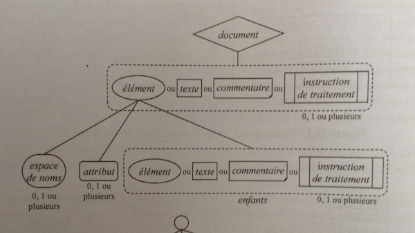
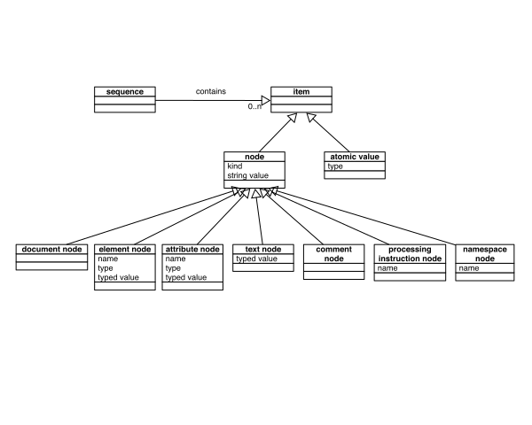
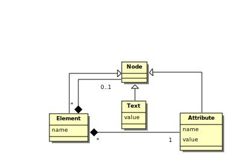
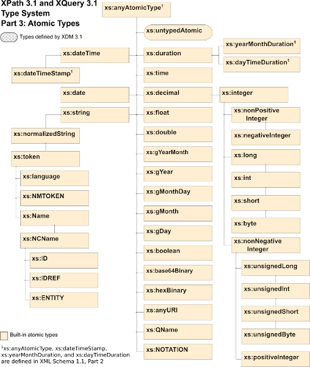

## HNU3052/HNU6052 Humanités numériques : introduction à la TEI

# Notion de Schéma

1. Introduction : modèle de données, nœuds et ordre du document
2. Notion de schéma

???

L’un des attraits principaux du format est de disposer d’une grammaire de documents, qui s’exprime sous la forme d’un schéma.

---

### 1. Introduction
## 1.1. Le modèle de données de XML
La syntaxe XML correspond en réalité à un modèle abstrait désigné XDM pour XML Data Model : [http://www.w3.org/TR/xpath-datamodel/](http://www.w3.org/TR/xpath-datamodel/).

---

### 1. Introduction
## 1.2. Les **nœuds** dans le modèle XDM

XDM considère un document XML comme une structure d’arbre pouvant être composée de **sept types de nœuds**.

- `document node` (nœud document)
- `element node` (nœud élément)
- `attribute node` (nœud attribut)
- `comment node` (nœud commentaire)
- `processing instruction node` (nœud instruction de traitement)
- `text node` (nœud texte)
- `namespace node` (nœud espace de nom)

Voir [http://www.w3.org/TR/xpath-datamodel/](http://www.w3.org/TR/xpath-datamodel/).

???

XDM considère un document XML comme une structure d’arbre pouvant être composée de sept types de nœuds.

Ici, on monte en abstraction par rapport à ce que vous savez déjà peut-être de XML.

Ces **nœud** sont les sept types de nœuds définis dans le modèle de données XPath 1.0, à l’exception du nœud racine rebaptisé `document node` au lieu de `root node`.

---
### 1. Introduction
## 1.3. Contraintes des nœuds

Les éléments d’un document XML bien formé répondent à plusieurs contraintes



???

Les éléments d’un document XML bien formé répondent à plusieurs contraintes :

- un nœud document ne doit pas avoir de nœud père et peut avoir des nœuds fils qui peuvent être des nœuds élément, texte, commentaire, ou instruction de traitement
- un nœud élément peut avoir un nœud père qui doit être un nœud document ou élément et peut avoir des nœuds fils qui doivent être des nœuds espace de noms, attributs, élément, texte, commentaire ou instruction de traitement
- les nœuds fils d’un nœud document ou élément qui sont des nœuds élément, texte, commentaire ou instruction de traitement sont appelés les enfants de ce nœud
- un nœud document ou élément ne doit pas avoir deux enfants consécutifs qui sont des nœuds textes
- un nœud document ou élément ne doit pas avoir d’enfants qui sont des nœuds textes dont le contenu est vide
- un nœud espace de nom ou attribut peut avoir un nœud père qui doit être un nœud élément
- un nœud texte, commentaire ou instruction de traitement peut avoir un nœud père qui doit être un nœud élément ou document

---

### 1. Introduction
## 1.4. Ordre du document
Quelques règles :

- le `nœud racine` est le premier nœud après le nœud document
- les nœuds `element` précèdent leurs nœuds fils
- l’ordre relatif des nœuds frères entre eux est déterminé par leur ordre d’apparition dans la représentation balisée
- les nœuds `attribute` et `namespace` précèdent les nœuds fils de cet élément
- les nœuds `namespace` précèdent les nœuds `attribute`
- l’ordre des nœuds `namespace` et `attributs` dépend de l’implantation

???

Un document XML (ou un fragment de document) est composé d’une hiérarchie de nœuds.

Autrement dit, les nœuds qui sont accessibles lors d’une session de travail sont munis d’un ordre, qu’on appelle **ordre du document**. Cet ordre est défini tel que correspondant à l’ordre dans lequel le premier caractère de la représentation XML de chaque nœud apparaît dans le document XML balisé (après expansion des entités générales).

- le `nœud racine` est le premier nœud element après le nœud document, il contient tous les autres éléments
- les nœuds `element` précèdent leurs nœuds fils
- l’ordre relatif des nœuds frères entre eux est déterminé par leur ordre d’apparition dans la représentation balisée **(autrement dit, les nœuds descendants d’un nœud apparaissent avant le nœud frère)**
- les nœuds `attribute` et `namespace` précèdent les nœuds fils de cet élément
- les nœuds namespace précèdent les nœuds `attribute`
- l’ordre des nœuds `namespace` et `attribute` dépend de l’implantation

---

### 1. Introduction

## 1.4. Ordre du document
Description des relations :

- Enfant
    - Un élément peut avoir zéro, un ou plusieurs autres éléments enfants. Il peut également avoir des enfants texte, commentaire, et instruction de traitement.
    - Les attributs ne sont pas considérés comme les enfants d’un élément
    - Un nœud document peut avoir un élément fils (celui qui contiendra tous les autres) mais aussi des fils commentaire, ou instruction de traitement.
- Parent : le parent d’un élément est soit un autre élément soit un nœud document. Le parent d’un attribut est l’élément qui le porte. Attention ! Même si les attributs ne sont pas considérés comme fils des éléments, les éléments sont les parents des attributs !
- Ancêtre : les ancêtres sont les nœuds parents, les parents des parents, etc.
- Descendants : les descendants sont les enfants, petits-enfants, et tous les descendants d’un nœud.
- Sibling : les siblings d’un nœuds sont les autres enfants de son parent. Les attributs ne sont pas considéré comme des siblings.

<!-- .element style="font-size:0.9em" -->

---

## Les **composants** du modèle de données XML



???
Une autre manière possible de visualiser les différentes composantes définies par le modèle de données XML.

détailler séquence, item, etc.

---

## Version simplifiée du modèle XDM



<small>Eric Van der List. Simplified XDM. https://xmllondon.com/2014/slides/vlist/index.html#/step-16 CC-By 4.0</small>

---

### 1. Introduction
## 1.5. Les nœuds ont une identité

Chaque nœud possède une identité unique. On peut avoir deux nœuds avec le même nom et le même contenu dans le document source, mais cela ne signifie pas qu’ils auront la même identité. L’identité est unique pour chaque nœud, elle est affectée par le processeur.

Aux nœuds sont attachées différentes propriétés :

- Les éléments et les attributs possèdent un nom.
  Ces noms sont accessibles à l’aide des fonctions `node-name()`, `name()`, `local-name()`
- Pour chaque type de nœud, il est possible de déterminer ce que l’on appelle sa **valeur de chaîne** (`string value`) qui correspond schématiquement à son contenu textuel.
  On peut accéder à la valeur textuelle d’un élément avec la fonction `string()`
- On peut encore extraire d’un nœud sa **valeur typée** (`typed value`), son nom qualifié, etc.

???

### identité d’un nœud

Les nœuds ont une identité. Deux nœuds créés par deux expressions différentes sont distincts même s’ils ont le même nom, les mêmes fils, etc.

Chaque nœud possède une identité unique. On peut avoir deux nœuds avec le même nom et le même contenu dans le document source, mais cela ne signifie pas qu’ils auront la même identité. L’identité est unique pour chaque nœud, elle est affectée par le processeur.

### Aux nœuds sont attachées différentes propriétés :

### nom

En outre, les éléments et les attributs possèdent un nom. Ces noms sont accessibles à l’aide des fonctions `node-name()`, `name()`, `local-name()`

### Valeur textuelle

Par exemple, pour chaque type de nœud, il est possible de déterminer ce que l’on appelle sa valeur de chaîne (`string value`) qui correspond schématiquement à son contenu textuel.

Les nœuds peuvent avoir deux types de valeur, une valeur de chaîne et une valeur typée. Tous les nœuds ont un contenu textuel (string value). La valeur textuelle d’un élément est la concaténation des données caractères de cet élément et de ses descendants.

On peut accéder à la valeur textuelle d’un élément avec la fonction `string()`

On peut encore extraire d’un nœud sa valeur typée (`typed value`), son nom qualifié, etc.

Globalement : se souvenir qu’un nœud possède un nom, et une valeur textuelle à laquelle on pourra accéder à l’aide d’une expression XPath

---

## 2. Notion de schéma

1. Modèles de documents
2. Un schéma
3. Définition d’éléments
4. Un ou plusieurs
5. Création des sous-éléments
6. Éléments optionnels
7. Choix
8. Définition des attributs
9. Énumération
10. Motifs nommés
11. Typage

---

### 2. Notion de schéma
## 2.1. Modèles de documents

**Définissent les contraintes que doit respecter une certaine classe de documents**

**Syntaxes** : diverses syntaxes peuvent être utilisées pour écrire de tels modèles :

- DTD (partie intégrante de la norme XML 1.0), la plus utilisée encore aujourd’hui ;
- [schémas XML](<http://www.w3.org/XML/Schema>), norme du W3C publiée en mai 2001 ; 2e édition octobre 2004 ;
- [schémas RelaxNG](<http://www.relaxng.org/>), norme ISO/IEC 19757-2, depuis 2003, amendée en 2008.

**Validation** : beaucoup d’applications XML sont validantes, ainsi un processeur XSLT n’opérera de transformation à partir d’un document XML associé à un modèle que si ce document XML est valide.

???

Les schémas, qui peuvent s’écrire en XML quelle que soit la syntaxe choisie, permettent de contraindre plus fortement que les DTD le contenu des attributs et des éléments, et gèrent les espaces de noms.
Un parseur sachant interpréter la syntaxe utilisée pourra vérifier qu’un document est conforme à un modèle donné (est valide).

Exemples de parseurs : ceux intégrés aux éditeurs XML, aux navigateurs Web ; xmllint dans la librairie libxml, etc.

Beaucoup d’applications XML sont validantes, ainsi un processeur XSLT n’opérera de transformation à partir d’un document XML associé à un modèle que si ce document XML est valide.

---
### 2. Notion de schéma
## 2.2. Un schéma

- Définition d’une grammaire
- Choix des séquences d’éléments
- Choix des cardinalités
- Définition de contextes
- Valeurs prédéfinies
- Valeurs typées

---

### 2. Notion de schéma
## 2.3. Définition d’éléments

On souhaite avoir un élément racine `addressBook` qui contient un élément `entry`

```xml
<element name="addressBook"
         xmlns="http://relaxng.org/ns/structure/1.0">
  <zeroOrMore>
  	<element name="entry">
    	<text/>
    </element>
  </zeroOrMore>
</element>
```

---

### 2. Notion de schéma
## 2.4. Un ou plusieurs

On souhaite avoir un élément racine `addressBook` qui contient **au moins** un élément `entry`

```xml
<element name="addressBook"
         xmlns="http://relaxng.org/ns/structure/1.0">
  <oneOrMore>
    <element name="entry">
        <text/>
    </element>
  </oneOrMore>
</element>
```

---

### 2. Notion de schéma
## 2.5. Création des sous-éléments

```xml
<element name="addressBook"
         xmlns="http://relaxng.org/ns/structure/1.0">
  <zeroOrMore>
    <element name="entry">
      <element name="name">
        <text/>
      </element>
      <element name="email">
        <text/>
      </element>
    </element>
  </zeroOrMore>
</element>
```

---

### 2. Notion de schéma
## 2.6. Éléments optionnels

Chaque élément `entry` doit comporter au moins un nom, les autres éléments sont optionnels

```xml
<element name="addressBook"
         xmlns="http://relaxng.org/ns/structure/1.0">
  <oneOrMore>
    <element name="entry">
      <element name="name">
        <text/>
      </element>
      <optional>
      	<element name="adress">
        	<text/>
        </element>
        <element name="email">
        	<text/>
        </element>
      </optional>
    </element>
  </oneOrMore>
</element>
```

---

### 2. Notion de schéma
## 2.7. Choix

Chaque élément `entry` doit comporter au moins un nom, et une adresse ou un courriel

```xml
<element name="addressBook"
         xmlns="http://relaxng.org/ns/structure/1.0">
  <oneOrMore>
    <element name="entry">
      <element name="name">
        <text/>
      </element>
      <choice>
      	<element name="adress">
          <text/>
        </element>
        <element name="email">
          <text/>
        </element>
      </choice>
    </element>
  </oneOrMore>
</element>
```

---

### 2. Notion de schéma
## 2.8. Définition des attributs

```xml
<element name="email">
  <zeroOrMore>
    <optional>
      <attribute name="type"
        <text/>
      </attribute>
    </optional>
    <text/>
  </zeroOrMore>
</element>
```

---

### 2. Notion de schéma
## 2.9. Énumération

```xml
<element name="email">
  <zeroOrMore>
    <optional>
      <attribute name="type">
        <choice>
          <value>travail</value>
          <value>domicile</value>
        </choice>
      </attribute>
    </optional>
    <text/>
  </zeroOrMore>
</element>
```

---

### 2. Notion de schéma
## 2.10. Motifs nommés

```xml
<grammar>
  <start>
    <element name="addressBook">
      <zeroOrMore>
        <element name="entry">
          <ref name="entryContent"/>
        </element>
      </zeroOrMore>
    </element>
  </start>
  <define name="entryContent">
    <element name="name">
      <text/>
    </element>
    <element name="email">
      <text/>
    </element>
  </define>
</grammar>
```

---

### 2. Notion de schéma
## 2.11. Typage

```xml
<element name="number">
  <data type="integer"
        datatypeLibrary="http://www.w3.org/2001/XMLSchema-datatypes"/>
</element>
```

On peut ici tirer profit de nombreux types définis par le standard

- `xs:date`
- `xs:integer`
- `xs:double`
- `xs:decimal`
- `xs:string`
- ...

<http://www.w3.org/TR/xmlschema-2/>

<https://www.w3.org/TR/xpath-datamodel-31/>

---



<!-- .element img="max-height: 90%; max-width: 50%;" -->

???

<https://www.w3.org/TR/xpath-datamodel-31/>

### [XML Schema](http://www.w3.org/TR/xmlschema-2/)

---

## JSON Schema

https://json-schema.org

Depuis quelques années, un projet de spécification de schéma est développée pour JSON.

```json
{
  "$id": "https://example.com/person.schema.json",
  "$schema": "https://json-schema.org/draft/2020-12/schema",
  "title": "Person",
  "type": "object",
  "properties": {
    "firstName": {
      "type": "string",
      "description": "The person's first name."
    },
    "lastName": {
      "type": "string",
      "description": "The person's last name."
    },
    "age": {
      "description": "Age in years which must be equal to or greater than zero.",
      "type": "integer",
      "minimum": 0
    }
  }
}
```

---

## Pour aller plus loin

- Spécification RelaxNG : [https://relaxng.org/spec-20011203.html](https://relaxng.org/spec-20011203.html)
- Tutoriel : [https://relaxng.org/tutorial-20011203.html](https://relaxng.org/tutorial-20011203.html)
