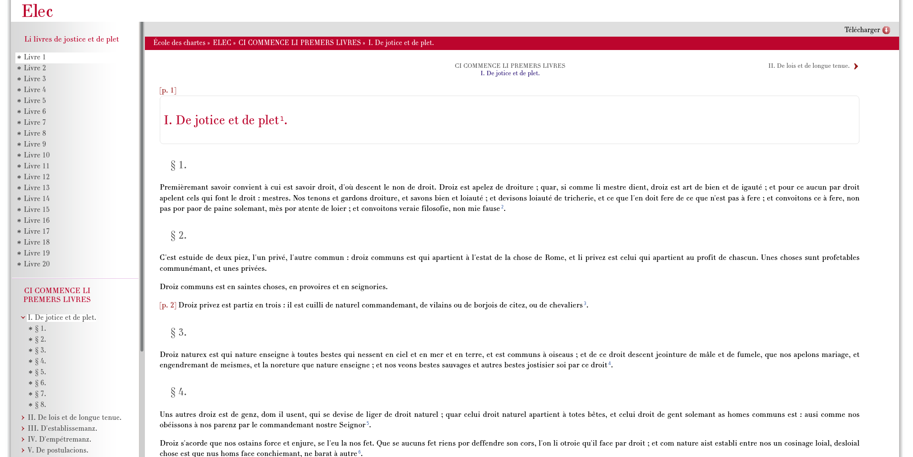
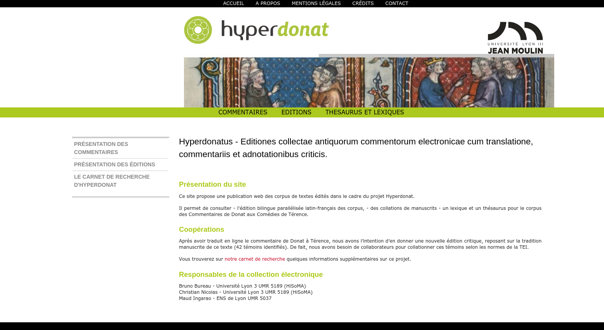
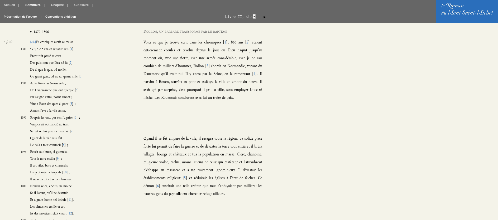
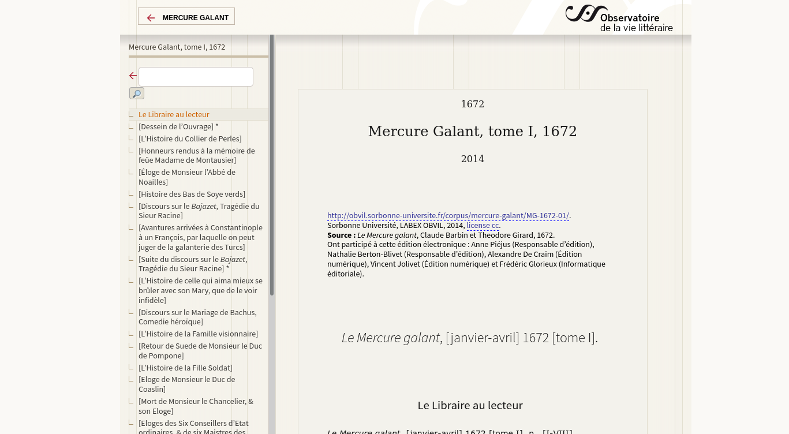
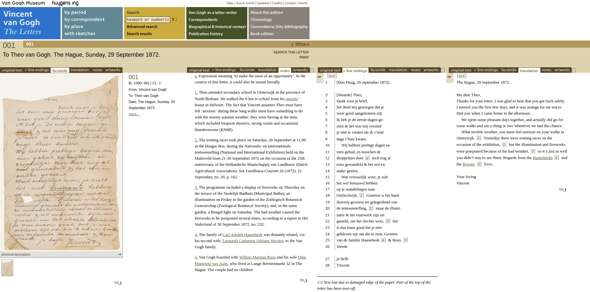
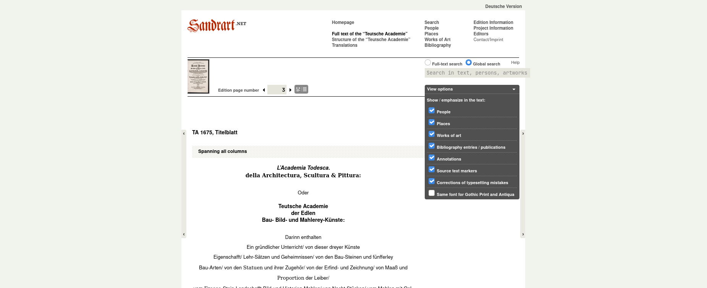
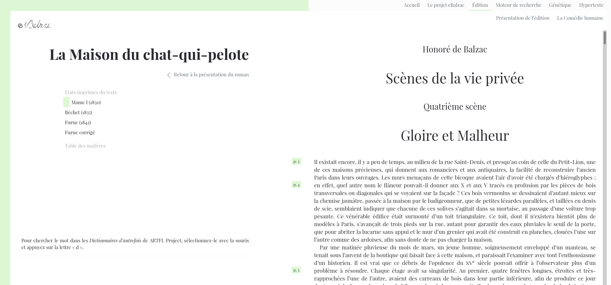

## HNU3052/HNU6052 Humanités numériques : introduction à la TEI

# Panorama d’utilisations de la TEI dans le domaine éditorial

???
Après la plus longue présentation de la semaine dernière sur l'édition critique ([à retrouver ici](/03-xml/)), voici un bref panorama d'utilisations de la TEI dans le domaine éditorial.

---

## Éditions en ligne de l’École des chartes (Élec)

[http://elec.enc.sorbonne.fr](http://elec.enc.sorbonne.fr)

???

> Parallèlement à ses différentes collections de publications imprimées, l’École des chartes propose sur ce site une collection de publications électroniques. Celle-ci permet d’offrir à des travaux scientifiques des fonctionnalités propres au numérique. Elle réunit essentiellement des répertoires et des bases de données, ainsi que des éditions de textes, qui peuvent ainsi être explorées plus finement que par la consultation d’une version imprimée.

---

## Hyperdonat

[http://hyperdonat.huma-num.fr/editions/html/index.html](http://hyperdonat.huma-num.fr/editions/html/index.html)

???

> Le projet Hyperdonat tire son nom du grammairien latin du 4e siècle Aelius Donat, considéré par les médiévaux comme le père de la grammaire, mais qui fut aussi un maître dans l'art du commentaire grammatical. Si son commentaire virgilien est en grande partie perdu, il nous reste avec le commentaire qu'il a donné du théâtre de Térence un magnifique exemple de cet art de l'explication des auteurs que l'Antiquité a légué au Moyen Age et à l'époque moderne. C'est la raison pour laquelle c'est sous le patronage de Donat que nous inscrivons l'édition des divers commentaires qui constituent notre corpus. Celui-ci est ouvert à tous types de commentaires, profanes ou chrétiens, antiques ou médiévaux, voire modernes, en grec ou en latin, voire en toute autre langue. Il a vocation à accueillir ainsi non seulement l'érudition antique, mais encore la science médiévale ou renaissante, la riche collection de l'exégèse chrétienne ou juive, voire bien d'autres textes encore. Si vous souhaitez proposer un projet, vous pouvez le faire en utilisant la page "contact" de ce site.

---

## Le Roman du Mont Saint-Michel

[https://www.unicaen.fr/services/puc/sources/gsp/](https://www.unicaen.fr/services/puc/sources/gsp/)

???

> Les documents présentés sur ce site entrent dans un programme de publication multi-supports organisé autour du travail d’édition critique (établissement du texte, traduction, commentaire philologique et historique) réalisé par P. Bouet et O. Desbordes sur les Chroniques latines du Mont Saint-Michel et par C. Bougy sur le Roman du Mont Saint-Michel de Guillaume de Saint Pair. Une partie de leurs recherches a été sélectionnée et mise en ligne afin de permettre l’accès d’un public élargi aux sources médiévales de l’histoire du Mont Saint-Michel.

---

## Mercure galant

[https://obvil.sorbonne-universite.fr/projets/mercure-galant](https://obvil.sorbonne-universite.fr/projets/mercure-galant)

???

> Document, monument, le Mercure galant (1672-1710), conçu comme une histoire officielle du règne de Louis XIV, orienté par son rôle politique, par sa vocation galante et par la mise en texte des événements, s’impose pourtant aussi comme une source majeure pour l’histoire de la vie artistique, et un poste d’observation privilégié de l’émergence de la critique des lettres et des arts en France. Le programme scientifique, fondé en 2002, vise à produire des éditions numériques du périodique et des thesauri interopérables, et à mener une réflexion scientifique, collective et pluridisciplinaire, tant sur le périodique lui-même que sur l’apport de cette expérience de recherche aux humanités numériques.

---

## Van Gogh Letters

[vangoghletters.org](http://vangoghletters.org/vg/)

???

> In traditional scholarly publishing terms, this web edition is a study edition. That is to say it is intended for Van Gogh specialists, art historians and literary scholars studying Van Gogh’s letters or work, and students of art history, the history of literature and allied disciplines. Of course the internet is an open medium accessible to anyone, but the decision to produce this as a scholarly edition implies that the level of the content of the textual apparatus is tailored to students and people with an academic background.

---

## Sandrart.net

[sandrart.net](http://www.sandrart.net/en/project/)

???
> The project’s main goal was an annotated, enriched and web-based edition of Joachim von Sandrart’s Teutscher Academie der Edlen Bau, Bild- und Mahlerey-Künste (1675–80), one of the most important source texts of the early modern period. Having lived and worked in a number of places throughout Europe, Sandrart’s biographical background makes his writings (with first-hand narrations on art, artists and art collections) a work of European dimension.

---

## eBalzac

[https://www.ebalzac.com](https://www.ebalzac.com)

???

> eBalzac s’est donné pour mission de rendre accessible gratuitement l’ensemble des états imprimés de l’œuvre balzacienne : La Comédie humaine, les œuvres de jeunesse, le théâtre, les Contes drolatiques et les œuvres diverses. À terme, les éditions successives des textes balzaciens seront disponibles en trois formats : html, epub et un format jpg qui permet de consulter le fac-similé de l’édition d’époque.

---

## Exercice
Afin de comprendre comment ces projets fonctionnent et quelles sont les choix d'encodage, de schéma et d'édition critique qui ont été réalisés, choisissez **un projet** et analysez-le en répondant aux questions suivantes :

- quelles sont les sources des documents (facsimilés) ?
- quelles sont les fonctionnalités proposées permises par l'encodage en XML TEI ?
- pouvez-vous accéder aux versions XML des éditions ?
- comment est utilisé le schéma TEI ?

???

Pour la prochaine séance vous devrez prolonger ce travail d'analyse en vous servant des critères mis en place par A review journal for digital editions and resources :  
[https://www.i-d-e.de/publikationen/weitereschriften/criteria-version-1-1/](https://www.i-d-e.de/publikationen/weitereschriften/criteria-version-1-1/)
