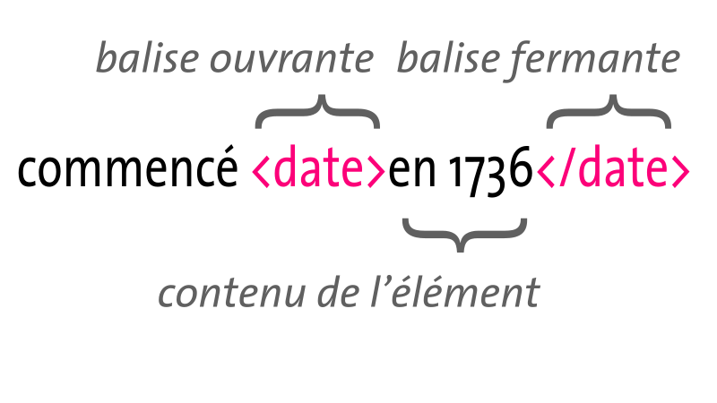
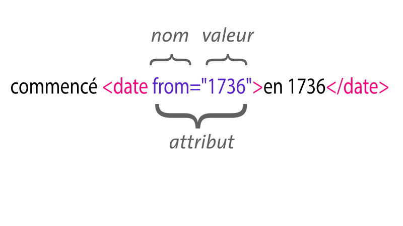
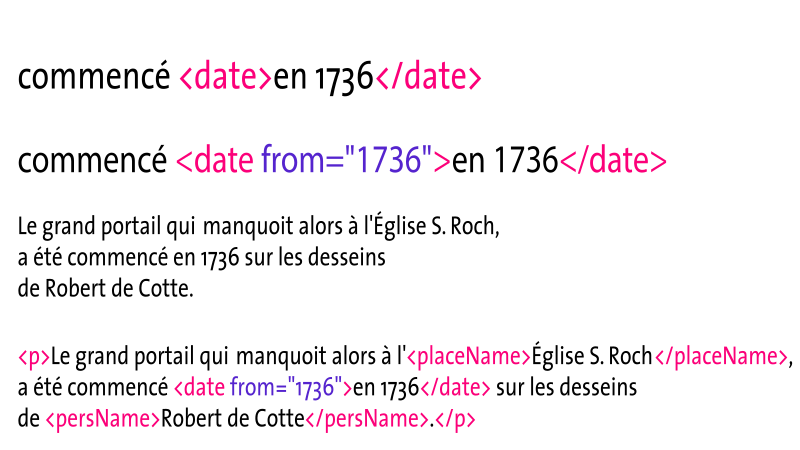

## HNU3052/HNU6052 Humanités numériques : Introduction à l’édition critique avec la Text Encoding Initiative (TEI)

# eXtensible Markup Language

1. Pourquoi encoder son édition ?
2. Principes de conception du langage XML
3. La syntaxe XML

???

Dans cette première partie du cours, nous allons présenter le langage de balisage extensible (eXtensible Markup Language, XML). XML est un format informatique utile pour de très nombreuses applications. Il est notamment largement utilisé dans le domaine des métadonnées culturelles ou pour l’échange d’informations structurées. XML est un métalangage au sens où il définit une syntaxe qui permet de décrire toute sortes de vocabulaires pour les métadonnées. 

Ce format occupe une place fondamentale dans le domaine de l’édition structurée en raison de son excellente capacité à prendre en charge la description du texte et de ses sous-composants. Il s’est également largement imposé dans le secteur éditorial en raisons d’un puissant outillage technique qui lui est associé tant pour le contrôle des documents que pour leur transformation. En ce sens, XML offre une infrastructure technique particulièrement adéquate pour l’édition et se retrouve à peu près partout dans les applications industrielles du secteur.

Le domaine des éditions critiques numériques est un secteur qui connaît depuis plusieurs années une évolution rapide. S’il n’existe pas vraiment de norme ou de références uniques sur la forme que doivent avoir les éditions, certaines réalisations constituent des références structurantes fortes, par ailleurs il existe certains standards techniques à l’instar de la Text Encoding Initiative (TEI) que nous allons aborder au cours de cette formation.

Cette première présentation s’intéressera plus particulièrement aux caractéristiques attendues d’une édition critique et à la manière dont on peut y répondre en utilisant un balisage descriptif.

1. Caractéristiques attendues d’une édition critique

2. La prise en charge de l’édition critique par un balisage descriptif

---

## 1. Pourquoi encoder son édition ?

1. Préambule sur les éditions critiques
2. Pourquoi du balisage ?
3. Origines de XML

---
### 1. Pourquoi encoder son édition ?

## 1.1. Préambule sur les éditions critiques
Qu’est-ce qu’une édition critique ?

Caractère savant :

- Un essai de reconstitution d’un texte
- Objectivité / parti-pris

Critères de scientificité :

* Fiable
* Consistante
* Justification des partis-pris

???

Caractéristiques attendues d’une édition critique

## Un essai de reconstitution d’un texte

On parle d’édition critique, ou d’édition scientifique –&nbsp;l’adjectif dans appellation venant en désigner le caractère savant&nbsp;–, au sens où il s’agit de produire **une reproduction contrôlée** d’un texte dont sont procurés les états, versions, variantes et leçons.

On pourra se référer à la bibliographie ecdotique traditionnelle, mais aussi à une abondante littérature en langue anglaise sur l’édition numérique.

De ce point de vue, l’édition critique constitue, selon la définition du manuel de l’École nationale des chartes sur l’édition des textes médiévaux, un Essai de reconstitution d’un texte, pour lequel l’éditeur pèse chacun des mots du texte en se servant de tous les moyens de jugement dont il dispose. Pascale Bourgain et Françoise Vielliard. **Conseils pour l’édition des textes médiévaux, Paris, Comité des travaux historiques et scientifiques** / École nationale des chartes, 2002 (Documents d’archives, n° Fascicule III, Textes littéraires).

## Plusieurs genres d’édition critique
Cas particuliers&nbsp;:
* l’édition imitative ou diplomatique qui reproduit très exactement un document unique, jusqu’en ses particularités graphiques et mêmes ses erreurs, commentées à part mais pas corrigées dans le texte&nbsp;;

* l’édition synthétique, intégrant différents états du texte suffisamment peu différents, moyennant un artifice typographique, avec comme variante l’édition génétique, qui rend compte par des artifices typographiques des différentes couches ou états successifs du texte&nbsp;;

* l’édition variorum, qui donne le texte accompagné, outre l’apparat normal des variantes, de toutes les solutions des éditeurs précédents.
Pascale Bourgain, et Françoise Vielliard. Conseils pour l’édition des textes médiévaux. Paris&nbsp;: Comité des travaux historiques et scientifiques / École nationale des chartes, 2002, (Documents d’archives, n° Fascicule III, Textes littéraires).

## Critères de scientificité

Il s’agit toujours de fournir un texte, et dans le domaine historique de savoir comment rendre compte le plus fidèlement possible de la source.

Même si le domaine de l’édition scientifique a connu de profonds changements au cours de ces dernières années avec l’irruption du numérique, les opérations à la base de toute édition critique sont toutefois restées pour l’essentiel identiques.

**La tâche principale de l’éditeur est de produire un texte fiable et consistant, avec des partis-pris éditoriaux explicites et appropriés.**

La production d’une telle édition peut mobiliser des savoirs relativement étendus. Elle implique que l’éditeur dispose non seulement des savoirs traditionnellement associés à l’édition des sources primaires&nbsp;:

* Il doit en effet être en mesure d’identifier comment le texte a été construit, à la fois comme document et comme instance de l’œuvre.
* Il doit également savoir comment celui-ci a été transmis, altéré ou transformé au cours du temps, etc.
* Mais l’éditeur doit encore être en mesure de connaître son lectorat, et d’identifier la meilleure manière de communiquer les textes, et ce qu’il en sait.

Ainsi&nbsp;:  
Une édition critique n’est pas une reproduction photographique. Elle résulte d’un compromis raisonnable entre, d’une part, le respect du texte à publier (dont on ne doit en aucun cas moderniser la graphie) et, d’autre part, le souci de le rendre aussi intelligible que possible pour un lecteur d’aujourd’hui.Bernard Barbiche, Monique Châtenet, Jean Delmas, Olivier Guyotjeannin, et Jean-François Belhoste. **L’Édition des textes anciens : XVI**&lt;sup&gt;**e**&lt;/sup&gt;**-XVIII**&lt;sup&gt;**e**&lt;/sup&gt;**  siècle**. Paris&nbsp;: Association Études, loisirs, patrimoine, 1993 (Documents &amp; méthodes / Inventaire général des monuments et des richesses artistiques de la France, n° 1).
La production d’une édition critique de qualité exige de ce fait d’avoir bien défini son public de destination. Cette question est déterminante même si l’on ne renonce généralement pas à toucher un public un tant soit peu élargi.

Par exemple, dans le cas des Cours d’Antoine Desgodets à l’Académie d’architecture, s’agissant de mettre à disposition un corpus de textes inédits, établi d’après une tradition abondante de témoins manuscrits, l’édition des cours de Desgodets offrait un intérêt tout particulier pour l’historien de l’art et l’historien du droit. Elle devait présenter toutes les qualités habituellement requises par une édition de haute tenue scientifique en termes de fiabilité, de solidité et de justification des parti-pris. S’agissant d’un matériau entièrement neuf pour la recherche, il s’agissait également de faciliter son étude et de prendre en compte certaines particularités propres à des manuscrits architecturaux pour la consultation.

---

### 1. Pourquoi encoder son édition ?

## 1.1. Préambule sur les éditions critiques
Un investissement important :

* Méthode de travail adaptée (temps long, travail en équipe)
* Enjeux d’interopérabilité
* Problèmes de pérennité

???

# Un investissement important

Dès lors, la production d’une édition numérique constitue souvent un travail long et fastidieux qui nécessite un investissement important. Parce que celui-ci peut s’étaler sur plusieurs années ou être mené en équipe, son élaboration requiert habituellement la mise au point de méthodes de travail adaptées (temps long, travail en équipe).

Compte tenu de l’investissement engagé, il est aussi nécessaire de se préoccuper de questions d’interopérabilité. Par exemple, il peut s’avérer judicieux de prévoir la réutilisation et le partage de l’édition dans des bases textuelles collectives (Frantext, etc.). Cela suppose d’une part la production de métadonnées normalisées, mais aussi l’utilisation d’un schéma d’encodage bien documentés pour le partage et l’échange des fichiers.

À cela s’ajoute encore des problèmes de pérennité. Bien souvent, une édition critique est fournie pour plusieurs dizaines d’années, avant que l’on ressente le besoin, ou que l’on dispose des moyens d’en produire une nouvelle. Quoiqu’il en soit, il y a fort à parier que vous ne souhaitiez pas que tout votre travail soit perdu à la première évolution technique. Il convient donc de prévoir la conservation de son édition et de formuler des choix pour sa pérennisation. Les formats informatiques posent parfois des problèmes d’obsolescence technique, et en la matière, certains choix s’avèrent plus judicieux que d’autres de ce point de vue.

---

### 1. Pourquoi encoder son édition ?

## 1.2. L’avantage d’un balisage sémantique

Peut-on **(sérieusement)** utiliser un traitement de texte&nbsp;?

Plusieurs questions à se poser…

* La forme / le contenu
* L’expressivité
* Documentation de l’édition
* Contrôle de la production
* Obsolescence et interopérabilité

???

# Peut-on (sérieusement) utiliser un traitement de texte&nbsp;?

Ici, les critères de qualité d’une édition critique peuvent guider certains choix&nbsp;:

* Les traitements de texte sont souvent centrés sur la présentation. Question des formats de sorties, maintenance.
* Dans bien des cas, l’expressivité d’un logiciel de traitement de texte s’avère insuffisante pour documenter certains aspects de la source, en particulier lorsqu’il s’agit de manuscrit.
* Dans le contexte d’un travail collectif, il est souvent utile de disposer d’une méthode de travail qui assure un contrôle de la consistance de l’édition.
* Dans un objectif de pérennisation, envisager le statut des formats informatiques (ouverts vs propriétaires), les risques d’obsolescence technique, les problèmes de maintenance.

---

### 1. Pourquoi encoder son édition ?

## Définition des documents structurés

On appelle document structuré, un document dont la structure logique est décrite plutôt que sa mise en forme physique.

> Un document peut être décrit comme une collection d’objets comportant des objets de plus haut niveau composés d’objets plus primitifs. Les relations entre ces objets représentent les relations logiques entre les composants du document. Par exemple [...] un livre est divisé en chapitres, chaque chapitre en sections, sous-sections, paragraphes, etc. Une telle organisation documentaire est appelée représentation de document structuré.
>
> Jacques André, Richard Furuta, Vincent Quint, *Structured documents*, Cambridge University Press, 1989.

---

### 1. Pourquoi encoder son édition ?

## 1.2. L’avantage d’un balisage sémantique
La notion d’encodage :

- encodage descriptif

**vs**

- encodage présentationnel

???

## Encodage descriptif vs encodage présentationnel

Parce qu’il détermine tous les traitements informatiques qu’il est possible d’effectuer sur le texte, le balisage a historiquement constitué une question fondamentale dans l’histoire de l’informatique. Depuis l’article séminal de Coombs et ses collègues, on a pris l’habitude de distinguer plusieurs types de balisages&nbsp;: procédural, présentationnel, ou encore descriptif.

cf. James H. Coombs, Allen H Renear, et Steven J DeRose. [« Markup Systems and the Future of Scholarly Text Processing »](http:/.html.coverpages.org/coombs.html). **Communications of the ACM**, n° 11, t. 30, 1987, p. 933-947.

La supériorité du balisage descriptif sur les autres types de balisage du texte a clairement été établie depuis quelques années. Un tel balisage présente l’avantage notable d’assurer une meilleure distinction entre le contenu et la forme (et donc de séparer les traitements). Cette distinction garantit une meilleure maintenance du texte encodé et une meilleure portabilité des artefacts numériques.

## La notion d’encodage descriptif

- distinction entre le contenu et la forme
- maintenance du texte encodé
- portabilité du document

## L’héritier d’une longue histoire

Très tôt dans l’histoire de l’informatique, on s’est intéressé au problème de la représentation du texte sous forme numérique.


## La production d’un balisage descriptif

Identifier explicitement la structure sémantique sous-jacente d’un document, indépendamment de tout traitement déterminé à l’avance.

* Distinguer à l’intérieur du texte différents objets éditoriaux
* Fournir une information sémantique
* Possibilité de produire des vues distinctes

La production d’un balisage descriptif consiste à identifier explicitement la structure sémantique sous-jacente d’un document, cela indépendamment de tout traitement déterminé à l’avance.

cf. Renear, Allen, Dubin, David, Sperberg-McQueen, C. Michael, et Huitfeldt, Claus, [«&nbsp;XML semantics and digital libraries&nbsp;»](http://dl.acm.org/citation.cfm?id=827140.827192), Proceedings of the 3rd ACM/IEEE-CS joint conference on Digital libraries, p. 303-305, 2003.
Il s’agit de **distinguer explicitement à l’intérieur du texte différents objets éditoriaux** en les encadrant par des balises dont le nom peut être arbitraire.

Ce faisant l’auteur d’un balisage fournit une **information sémantique** et pragmatique suffisante pour produire des vues alternatives sur le document ou bien une édition basée sur la structure du texte.

---

### 1. Pourquoi encoder son édition ?

## 1.2. L’avantage d’un balisage sémantique
Procédure mise en œuvre lors du **balisage** :

* Reconnaissance des éléments
* Sélection des balises
* Réalisation du balisage, marquage de l’élément

```txt
Ceci est un paragraphe contenant une entité.
```

```xml
<para>Ceci est du texte contenant une <entity>entité</entity>.</para>
```

???

Le balisage est une opération au cours de laquelle on ajoute un descripteur au contenu en vue d’un traitement informatique. Un langage à balises est un langage permettant d’associer à un contenu (généralement du texte) des balises explicites (par exemple pour rendre compte de la structure du texte).

**La production d’un balisage descriptif consiste à identifier explicitement la structure sémantique sous-jacente d’un document, cela indépendamment de tout traitement déterminé à l’avance.**

cf. Renear, Allen, Dubin, David, Sperberg-McQueen, C. Michael, et Huitfeldt, Claus, [«&nbsp;XML semantics and digital libraries&nbsp;»](http://dl.acm.org/citation.cfm?id=827140.827192), Proceedings of the 3rd ACM/IEEE-CS joint conference on Digital libraries, p. 303-305, 2003.

**Il s’agit de distinguer explicitement à l’intérieur du texte différents objets éditoriaux en les encadrant par des balises dont le nom peut être arbitraire.**

Ce faisant l’auteur d’un balisage fournit une **information sémantique** et pragmatique suffisante pour produire des vues alternatives sur le document ou bien une édition basée sur la structure du texte.

## Procédure mise en œuvre lors du balisage

Les trois opérations qui interviennent au cours du balisage sont donc les suivantes&nbsp;:

1. la reconnaissance des éléments,
  - reconnaître que l’élément courant est un élément d’un certain type (paragraphe, citation en prose, note de bas de page, etc.)
  - reconnaître que l’élément courant est un élément d’un certain type (paragraphe, citation en prose, note de bas de page, etc.)
2. la sélection des balises,
  - déterminer le balisage qui s’applique au type d’élément reconnu
3. la réalisation du balisage,
  - marquage de l’élément à l’intérieur du flux textuel

cf. Coombs, James, et al., **op. cit.**

---

1. ### Pourquoi encoder son édition ?

## OHCO, Ordered Hierarchy of Content Objects

Une certaine modélisation du texte :

Avec ce type de balisage, le texte est envisagé comme une **hiérarchie ordonnée d’objets de contenus** (OHCO, _Ordered Hierarchy of Content Objects_, en anglais).

- structure hiérarchique
- relations linéaires

???

## OHCO, Ordered Hierarchy of Content Objects

L’idée d’un balisage descriptif qui repose sur le fait de marquer le contenu d’un texte par des éléments suggère une modélisation du texte particulière qui correspond une hiérarchie ordonnée d’objets de contenus (OHCO, Ordered Hierarchical Content Objects, en anglais).

Dans une telle représentation du texte, les éléments contenus (paragraphes, citations, phrases, notes, etc.) sont présentés à l’intérieur d’une structure hiérarchique. La structure du texte est hiérarchique parce qu’ils résident les uns à l’intérieur des autres. Les objets reçoivent donc des relations linéaires.

>The essential parts of any document form what we call ‘content objects’, and are of many types, such as paragraphs, quotations, emphatic phrases, and attributions. Each type of content object usually has its own appearance when a document is printed or displayed, but that appearance is superficial and transient rather than essential — it is the content elements themselves, along with their content, which form the essence of a document. When mnemonic names for these objects are specified, a document is said to include ‘descriptive markup.’
>
>Most content objects are contained in larger content objects, such as subsections, sections, and chapters. […] Generally, smaller content objects do not cross the boundaries of larger ones; thus a paragraph will not begin in one chapter and end in the next. For this reason, the structure of a document is a hierarchical one, like a tree or taxonomy.
>
>Smaller content objects that occur within a larger one, such as the sections within a chapter, or the paragraphs, block quotes, and other objects within a section, occur in a certain order. This ordering is essential information, and must be part of any model of text structure.
>Combining these essential elements, we can describe a text as an “ordered hierarchy of content objects,” or “OHCO”.
>
>(DeRose et al. 1990, 3-4).

D’autres représentations du texte sont également possibles : sémantique, etc.

---

### 1. Pourquoi encoder son édition ?

## 1.2. L’avantage d’un balisage sémantique
Avantages sur un balisage présentationnel :

1. Processus d’établissement du texte simplifié
2. Réduction des problèmes de maintenance
3. Meilleure portabilité

???

# Avantages sur un balisage présentationnel

Contrairement aux apparences, les logiciels de traitement de texte qui mettent en forme les documents ne simplifient pas la production de documents en éliminant le besoin du balisage. D’une certaine manière cela est devenu plus clair aujourd’hui avec l’adoption des formats XML par Microsoft Word et Open Office. Mais, le balisage requis pour ces formats, tout en étant plus consommateur de ressources, n’atteint pas la même expressivité qu’un simple balisage descriptif. Par ailleurs, les dispositifs d’édition fondés sur un balisage descriptif présentent plusieurs avantages sur le balisage fondé sur la présentation comme LaTex&nbsp;:

1. Le **processus d’établissement du texte se trouve simplifié** par la focalisation sur le contenu plutôt que sur le contrôle du programme (dans le cas d’un balisage procédural) ou de la présentation typographique de la copie (comme avec LaTex)
2. Les **questions de maintenance sont réduites** à un nombre limité de problèmes indépendants du fichier proprement dit. L’actualisation des styles et la mise à jour s’en trouvent facilitées sans risque de corruption des documents.
3. Enfin, ils fournissent de meilleurs standards dans le domaine patrimonial et culturel, ou pour l’industrie, du point de vue de la **portabilité**. Ils permettent en effet le partage aisé des fichiers et réduisent, à terme, les coûts de publication.

Autrement dit, le balisage descriptif offre un certain nombre d’avantages pour l’éditeur. Outre qu’il **permet de partager des documents pour collaborer sans se préoccuper d’éventuelles incompatibilités**, il offre un **gain de temps de production et de gestion en permettant la réalisation de plusieurs éditions successives à partir d’un même fichier source, ou de produire plusieurs manifestations (présentations) d’un même fichier**. De surcroît, ce balisage permet le plus souvent la **génération automatique de l’information bibliographique** directement à partir du fichier source (ce qui réduit les erreurs et permet une citation aisée dans les bases bibliographiques) ou d’inclure directement des documents dans des bases de données en ligne pour la publication et la recherche plein-texte.

Dans la perspective de produire une édition critique de qualité, privilégier le marquage sémantique plutôt que présentationnel présente plusieurs avantages notables tels que&nbsp;:

* Ne pas se contraindre du point de vue logiciel
* Profiter pleinement des possibilités offertes par le numérique
* Disposer d’un cadre de travail qui contrôle la qualité des documents

Même si la mise en place d’un balisage descriptif du texte, implique le déploiement d’une infrastructure technique sans-doute moins confortable pour travailler que l’utilisation de logiciels de traitement de texte, il faut relever qu’il permet de se concentrer sur le contenu du texte plutôt que sur la présentation physique finale du document. Bien entendu, concernant l’édition de manuscrits historiques, ou de sources primaires, il pourra être nécessaire de traiter la matérialité physique du document. Néanmoins c’est avant tout l’édition du texte qui est ici privilégiée. Dans une telle démarche, il convient en premier lieu de rendre la structure du texte explicite, c’est-à-dire de clarifier à la fois les relations hiérarchiques et séquentielles. Et la présence du balisage détermine la possibilité de traiter les éléments pour une transformation.

---

### 1. Pourquoi encoder son édition ?

## 1.3. Historique de XML
Le métalangage **XML**.

???

On vient de voir qu’un balisage descriptif permettait de **se concentrer sur le contenu du texte plutôt que sur la présentation physique finale du document**.

Dans une démarche qui privilégie avant tout l’édition du texte, il convient en premier lieu de **rendre la structure du texte explicite, c’est-à-dire de clarifier à la fois les relations hiérarchiques et séquentielles**. La présence du balisage détermine par la suite la possibilité de traiter les éléments pour une transformation.

---

### 1. Pourquoi encoder son édition ?

## 1.3. Historique de XML
eXtensible Markup Language (XML) :

Le métalangage informatique XML (Extensible Markup Language) permet le développement de vocabulaires descriptifs de balisages interopérables spécifiques à certains domaines.

- Un modèle de contenu arborescent
- Grammaire lisible par la machine
- Pas de réelle sémantique
- Une large utilisation dans le domaine culturel

???

Le métalangage informatique XML (Extensible Markup Language) permet le développement de vocabulaires descriptifs de balisages interopérables spécifiques à certains domaines.

cf. Bray, Tim, Paoli, Jean, Sperberg-McQueen, C. Michael, Maler, Eve, et Yergeau, François, Extensible Markup Language (XML) 1.0, Recommandation du W3C, 2008. [https://www.w3.org/TR/REC-xml/](https://www.w3.org/TR/REC-xml/)

## Un modèle de contenu arborescent
Son **modèle de contenu arborescent** est précisément conforme au modèle OHCO.

## Une grammaire lisible par la machine
S’il offre une grammaire lisible par la machine, il ne présente pas une réelle sémantique et ne peut donc à lui seul spécifier formellement une sémantique.

## Pas de réelle sémantique
XML ne fournit pas en soi la sémantique. XML propose simplement **une solution rigoureuse, compréhensible par les machines, pour définir un langage de balisage descriptif**.

### Une large utilisation dans le domaine culturel
Vogue de XML dans les années 2000, en particulier dans le milieu culturel. Très employé pour les métadonnées culturelles, et dans l’industrie.

La plupart des contenus des bibliothèques numériques aujourd’hui mis à disposition sur le web sont encodés en utilisant un balisage XML.

>La large adoption de vocabulaires XML spécialisés comme la TEI rendent disponible une importante information sémantique, mais seulement sous la forme d’une documentation en prose et de pratiques partagées.

Coombs, James H, Renear, Allen H, et DeRose, Steven J. "Markup Systems and the Future of Scholarly Text Processing." Communications of the ACM 30, no. 11 (1987): 933-947. [http://xml.coverpages.org/coombs.html](http://xml.coverpages.org/coombs.html)

Important stock de données encodées en XML, sans doute encore aujourd’hui, le format informatique le plus courant en terme de masse.

*Le texte comme principal cas d’application de XML.* Domaine dans lequel XML n’a toujours pas été remplacé. Modèle de contenu qui permet notamment de prendre en charge de manière efficace ce qu’on appelle du Contenu mixte.

---

### 1. Pourquoi encoder son édition ?

## 1.3. Historique de XML
Historique :

- 1986 : Définition du SGML (Standard Generalized Markup Language)
  (norme [ISO 8879:1986](https://www.iso.org/fr/standard/16387.html)).
- 1989 : Définition du HTML, dérivé du SGML
- 1998 : [XML 1.0](https://www.w3.org/TR/xml/), publication par le W3C des spécifications d’un métalangage de balisage du texte
- 2004 : [XML 1.1](http://www.w3.org/TR/xml11) (amélioration)
- (pour mémoire, la spécification de HTML5 en 2011 renonce à XML)

???

Un métalangage informatique pour le balisage du texte

## Un héritier de SGML

SGML lui-même héritier d’un langage descriptif conçu en 1969 par des ingénieurs de la société IBM : DCF (Document Composition Facility).

SGML : puissant et générique mais aussi trop souple et complexe en même temps → surtout utilisé dans le cadre d’applications lourdes. Utilisation la plus notable : langage HTML, dérivé du SGML =&gt; langage de publication pour le web. Né en 1989 et depuis 2011, HTML 5.


## Publication de XML

En février 1998 : publication en février 1998 par le W3C Consortium des spécifications du métalangage XML 1.0 =&gt; maîtres mots : simplicité, clarté, universalité.

Depuis 1998, la norme XML a peu évolué → dernière édition en date : 5^e^ édition, mise à jour en 2008. Version 1.0 =&gt; véritable témoignage de sa stabilité.

[Version 1.1](http://www.w3.org/TR/xml11) publiée en février 2004 et mise à jour en 2006, notamment pour intégrer les évolution d’Unicode.


## Un succès immédiat

Les langages et outils permettant de produire, contrôler, échanger, transformer et exploiter des fichiers XML se sont multipliés, souvent associés à des normes du W3C : modèles de documents et de (méta)données, langages de modélisation, de présentation, de programmation, protocoles, …

Métalangage désormais utilisé partout en informatique qu’il s’agisse de structurer des informations dont la durée de vie est importante ou d’échanger des informations entre applications, qu’on ait à s’occuper essentiellement de données, de documents ou d’une combinaison des deux.

Dans son Référentiel général d’interopérabilité publié en 2009, en France la Direction générale de la modernisation de l’État recommande l’utilisation des technologies XML (Extensible Markup Language) à des fins d’interopérabilité et de pérennisation de l’information.

Largement adopté également au Canada et aux États-Unis pour les Systèmes d’information gouvernementaux ou la gestion des textes législatifs et réglementaires.

cf. Ministre du Budget, des Comptes publics, Référentiel Général d’Interopérabilité (RGI), 2009. [http://references.modernisation.gouv.fr/rgi-interoperabilite](http://references.modernisation.gouv.fr/rgi-interoperabilite)

---

## 2. Principes de conception de XML

* applicable à tout type de texte
* extensible
* définition par un schéma
* hypertextualité
* simple, universel
* modèle hiérarchique

???

### Principes de conception de XML

* XML s’applique à tout type de texte&nbsp;: fondé sur le principe du balisage → càd : sur l’isolement d’une portion de texte et l’identification explicite de son rôle ou nature particulière. Autorise l’imbrication des balises et une granularité aussi fine que nécessaire.

* Un schéma est un modèle (=la liste des balises utilisables, leurs noms, les contraintes de leur emploi : position, cardinalité, type de contenu) peut être défini sous la forme d’une DTD (Document Type Definition) ou d’un schéma (écrit en RelaxNG ou directement XML).

* XML permet d’identifier la structure d’un texte et d’informer sur la sémantique des informations qu’il contient, ou d’en isoler les données =&gt; notion de structuration absolument primordiale : permet de rendre l’information exploitable par la machine (moteurs de recherche) et par l’utilisateur ; permet également à l’information d’être réutilisée, échangée, pérennisée. + bonne structure seule condition pour ensuite une transformation automatique.

* XML conçu à l’ère de l’hypermédia : liens peuvent être établis entre des sections du même document XML ou entre un document XML et d’autres ressources électroniques, qui peuvent ne pas être du texte.

* norme simple, sans ambiguïté, permettant à un humain de lire l’information produite.

* fichiers XML sont des fichiers texte (peuvent être lus par grand nombre de logiciels donc) et supportent surtout un grand nombre de systèmes d’écriture → utilise le standard Unicode et le codage par défaut de XML est UTF-8 (codage de caractères conçu pour coder l’ensemble des caractères Unicode).

* norme universelle, concentrée sur le contenu informationnel, ne traitant pas de son utilisation, indépendante des plates-formes informatiques (≠.odt, .doc, …).

* utiliser XML pour structurer et échanger l’information est considéré comme une bonne pratique → les documents XML sont de bons candidats pour l’archivage pérenne.

* grâce à leur structure réutilisation : l’accès, l’indexation et la recherche de l’information sont améliorées → on peut avec certains outils informatiques indexer un (ou un ensemble de) documents XML en exploitant leur marquage structurel, ce qui permet des recherches fines multicritères et améliore considérablement la qualité des réponses par rapport à une recherche plein texte dans un document non structuré.

* on peut aussi explorer un document XML en tant qu’arbre, en utilisant notamment le langage XPath. =&gt; XML : format de stockage pour autant de formats de diffusion qu’on souhaite. Après transformation par programmes dans un ou plusieurs formats dédiés, le contenu structuré d’un document XML peut être consulté sous forme imprimée (transformation directement en PDF ou vers LateX), sous forme électronique (HTML) =&gt; XML : format pivot pour les nouvelles chaînes éditoriales.

---

## 3. La syntaxe XML

1. XML en 4 points
2. La syntaxe XML
3. Spécification de l’encodage
4. Constructions syntaxiques
5. Arbre d’éléments
6. Contraintes syntaxiques des noms XML
7. Document bien formé

---

### 3. La syntaxe XML

## 3.1. XML en 4 points

1. **XML ne sert pas à afficher les données mais à les décrire**. Seul, il ne fait rien. Appliqué à la représentation des textes, il permet de décrire notamment leur structure
2. **Le nom des balises n’est pas prédéfini** : on peut librement créer son propre vocabulaire
3. **On peut utiliser une "grammaire" de balises (un schéma)**, pour définir des contraintes ou s’assurer de la consistance de l’encodage
4. **XML est auto-descriptif et lisible par l’homme**. Un fichier XML n’est rien que du texte, on peut facilement prendre connaissance d’un corpus dans n’importe quel éditeur textuel

???

### XML en 4 points

1. **XML ne sert pas à afficher les données mais à les décrire**. Seul, il ne fait rien. Appliqué à la représentation des textes, il permet de décrire notamment leur structure
2. **Le nom des balises n’est pas prédéfini** : on peut librement créer son propre vocabulaire
3. **On peut utiliser une « grammaire » de balises (un schéma)**, pour définir des contraintes ou s’assurer de la consistance de l’encodage
4. **XML est auto-descriptif et lisible par l’homme**. Un fichier XML n’est rien que du texte, on peut facilement prendre connaissance d’un corpus dans n’importe quel éditeur textuel

---
### 3. La syntaxe XML

## 3.2. La syntaxe XML

---

## Élément XML



---


## Attribut XML



---

## Exemple de balisage XML



---

### 3. La syntaxe XML

## 3.2. La syntaxe XML
Document XML avec son **prologue**

```xml
<?xml version="1.0"?>
<doc>
  <p n="1">This is a paragraph.</p>
  <p>This paragraph mentions <placeName>Bristol</placeName>.</p>
</doc>
```

- un simple fichier texte
- un élément qui contient tous les autres
- la coloration syntaxique est fournie par l’éditeur
- en première ligne : la **déclaration XML** qui fait partie du **prologue** du document

???

Un document XML prend toujours la forme suivante.

Un document XML consiste en une séquence de caractères lisibles par l’homme. C’est **un simple fichier texte** qui ne contient pas de code additionnel ou de données binaires.

Seulement, vous pouvez constater que ce document comporte certaines séquences de caractères régulières (ici mises en valeur par la coloration).

La première ligne de ce documents s’appelle une déclaration XML elle appartient au **prologue du document**. C’est une instruction qui permet d’indiquer qu’il s’agit d’un document XML et la version du langage.

---

### 3. La syntaxe XML

## 3.3. Spécification de l’encodage

```xml
<?xml version="1.0" encoding="UTF-8"?>
<doc>
  <p n="1">This is a paragraph.</p>
  <p>This paragraph mentions <placeName>Bristol</placeName>.</p>
</doc>
```

???

On peut également préciser l’encodage des caractères (par défaut en XML mais une bonne pratique).

Ici on déclare l’utilisation de l’encodage de caractère UTF-8 (pour Universal Character Set) qui permet de représenter la plupart des caractères du «&nbsp;répertoire universel de caractères codés&nbsp;» initialement développé par l’[ISO (ISO/CEI 10646)](http://www.iso.org/iso/fr/catalogue_detail.htm?csnumber=51273), aujourd’hui entièrement compatible avec le standard Unicode.

Le répertoire Unicode peut contenir plus d’un million de caractères.

* cf. [https://fr.wikipedia.org/wiki/UTF-8](https://fr.wikipedia.org/wiki/UTF-8)
* cf. [Jukka Korpela. "Guide to the Unicode standard"](http://www.cs.tut.fi/~jkorpela/unicode/guide.html)

---

### 3. La syntaxe XML

## 3.4. Constructions syntaxiques

- Les séquences `<`, `>` et `</` délimitent les balises : `<div></div>`
- Les paires nom-valeur des attributs ont la forme `nom='valeur'` équivalente à `nom="valeur"`
- Syntaxe des éléments vides : `<div></div>` = `<div/>`


???

Les caractères `&lt;` et `&gt;` sont utilisés pour marquer le début et la fin de balises à l’intérieur de ce flux textuel. Ces éléments possèdent un nom.

Vous remarquez que ces balises, ou markup, ou encore étiquettes (tag), sont **appariées&nbsp;**: à chaque balise ouvrante correspond une balise fermante qui se distingue en débutant par la séquence `&lt;/`.

Les balises et leur contenu forment un élement XML.

Ici, le document présente également des attributs. Ce sont des paires nom-valeurs qui se rattachent aux éléments.

Notez la syntaxe particulière des éléments vides.

---

### 3. La syntaxe XML

## 3.5. Arbre d’éléments
Le corps du document XML est un **arbre d’éléments** :

- Les éléments : permettent de décomposer le texte en unités d’information

```xml
 <titre>Le corps du document XML : un arbre d’éléments</titre>
```

- **Tout élément a un nom** (parfois appelé *identificateur générique*), ici c’est titre. Ces noms d’éléments obéissent aux contraintes syntaxiques des noms XML
- **Un élément peut contenir du texte et/ou d’autres éléments (contenu mixte), ou être vide**.

```xml
<p>Exemple de contenu mixte avec
  une <name>entité-nommée</name> et un élément vide<pb/>
</p>
```

- Il existe un et un seul élément englobant tous les autres, encodé en premier, juste après le prologue : c’est **l’élément racine**.


???

### Le corps du document XML consiste en un arbre d’éléments

Les éléments permettent de décomposer le texte en unités d’information

La portion de texte ainsi isolée est marquée par une balise de début (balise ouvrante) et par une balise de fin (balise fermante)

Tout élément a un nom (parfois appelé identificateur générique), ici c’est titre. Ces noms d’éléments obéissent aux contraintes syntaxiques des noms XML

Un élément peut contenir du texte et/ou d’autres éléments (contenu mixte), ou être vide.

Il existe un et un seul élément englobant tous les autres, encodé en premier, juste après le prologue : c’est l’élément racine.

---

## Les attributs

* syntaxe&nbsp;: `nomAttribut="valeur"` ou `nomAttribut='valeur'`
* la valeur est encadrée par des guillemets simples ou doubles
* le nom de l’attribut obéit aux **contraintes syntaxiques des noms XML**
* L’ordre des attributs n’est pas prescrit pour un élément donné
* Un attribut doit nécessairement avoir une valeur, même si cette valeur est nulle `attribut=""`
* Pour un même élément, il ne peut y avoir deux attributs de même nom `rend="bold center"`

???

Les attributs ne contiennent que du texte, ils ne peuvent donc pas servir pour stocker de l’information structurée.

En principe ne sont pas destinés à ajouter du contenu à l’élément, donc leur valeur n’est pas destinée à être affichée telle quelle dans un format de sortie. Mais ils pourront être exploités par des applications informatiques pour faire par exemple des index, ils peuvent servir à identifier les éléments (attributs de type ID), à établir des renvois (attributs de type IDREF).

* syntaxe&nbsp;: `nomAttribut="valeur"` ou `nomAttribut='valeur'`
* la valeur est encadrée par des guillemets simples ou doubles
* le nom de l’attribut obéit aux **contraintes syntaxiques des noms XML**
* L’ordre des attributs n’est pas prescrit pour un élément donné
* Un attribut doit nécessairement avoir une valeur, même si cette valeur est nulle `attribut=""`
* Pour un même élément, il ne peut y avoir deux attributs de même nom `rend="bold center"`


---

## Les attributs

Les attributs précisent la signification des éléments, leur ajoutent des caractéristiques.

```xml
<date when="2011-03-09">9 mars 2011</date>
```

Toujours saisi **à l’intérieur** de la balise ouvrante de l’élément.

Pour un même élément, il ne peut y avoir deux attributs de même nom. Afin de répéter une valeur on la sépare par un espace.

```xml
<hi rend="`rend="bold center"`">à lire</date>
```

---

## JSON vs XML

```xml
<?xml version="1.0" encoding="UTF-8"?>
<anvil reference="acme-5103">
    <weight unit="pound">9.5</weight>
    <composition>best wrought iron</composition>
    <price currency="USD">.15</price>
</anvil>
```

```json
[
  "anvil": {
    "reference": "acme-5103",
    "weight": {
      "unit": "pound",
      "value": 9.5
    },
    "composition": "best wrought iron",
    "price": {
      "currency": "USD",
      "value": .15
    }
  }
]
```

???

Décrivent le même objet.

Paraissent similaires car décrivent le même objet.

L’un plus orienté sérialisation, l’autre orienté document.

Cas du contenu mixte

Pas sur le même niveau (c’est comme comparer l’assembleur à C, JavaScript à XForms ou RDF et les Topics maps).

JSON de plus bas niveau

---

## Exemple de contenu mixte en JSON

```xml
<p>I can support <a href="http://en.wikipedia.org/wiki/PCDATA">
  <b>mixed</b> content</a> !</p>
```

```json
[{
    "name": "p",
    "children": [
        "I can support ",
        {
            "name": "a",
            "attributes": {"href": "http://en.wikipedia.org/wiki/PCDATA"},
            "children": [
                {
                    "name": "b",
                    "children": ["mixed"]
                },
                " content"
            ]
        },
        "!"
    ]
}]
```

---

### 3. La syntaxe XML

## 3.6. Contraintes syntaxiques des noms XML
Règles pour l’écriture de ces noms (identificateurs génériques)&nbsp;:

* la chaîne de caractères formant le nom **peut contenir**
  - les caractères alphanumériques (lettres de `a` à `z`, et de `A` à `Z`, chiffres de `0` à `9`, caractères non latins),
  - le trait sous la ligne `_`,
  - le trait d’union `-`
  - et le point `.` (à l’exclusion de tout autre signe de ponctuation ou espace)&nbsp;;
* un nom **ne peut pas commencer** par un nombre, ni par un point, ni par un trait d’union&nbsp;;
* le nom ne peut pas commencer par `xml` (quelle que soit la casse utilisée).
* Attention, XML est **sensible à la casse**&nbsp;!

---

### 3. La syntaxe XML

## 3.6. Contraintes syntaxiques, appels d’entités
**Entités internes** : entités caractères prédéfinies pour saisir certains caractères que l’on doit obligatoirement coder ( `<`, `>`, `&`, `"`, `'` : caractères codés au moyen des entités `lt`, `gt`, `amp`, `quot`, `apos`)

**Entités externes** : XML propose des mécanismes pour donner un nom à des expressions ou phrases souvent répétées ou pour taper des caractères difficiles à composer au clavier.

* texte : fragments XML formant chacun un fichier
* non parsées (fichiers non XML tels qu’images, enregistrements sonores…)

**Un appel d’entité dans le corps du document XML se fait en utilisant l’esperluette (`&`), suivi du nom donné à l’entité, suivi du signe `;`.**

appel|entité
:--|:--
`&` `amp` `;` &nbsp; | &amp;
`&` `gt` `;` &nbsp; | &gt;
`&` `lt` `;` &nbsp; | &lt;

???

Les entités : des réserves de contenu, la plupart du temps à déclarer (dans la DTD) et utilisables n’importe où dans le document


## entités texte,

servant à donner un nom à des expressions ou phrases souvent répétées

## Entités externes :

- texte : fragments XML formant chacun un fichier

- non parsées (fichiers non XML tels qu’images, enregistrements sonores...)

---

### 3. La syntaxe XML

## 3.6. Contraintes syntaxiques, commentaires
Les commentaires :

- Commencent par `<!--` et se terminent par `-->`
- Le double trait d’union «&nbsp;--&nbsp;» ne doit pas apparaître au sein d’un commentaire

Servent à… commenter, utiles pour documenter ce qu’on fait ou consigner des notes. Ne sont pas destinés aux programmes informatiques, qui les ignorent par défaut.

```xml
<!-- exemple de commentaire -->
<p>du texte <!-- un autre commentaire --> suite du texte</p>
```

---

### 3. La syntaxe XML

## 3.6. Contraintes syntaxiques, instructions de traitement
Les instructions de traitement servent à fournir dans le document des instructions pour un programme (feuille de transformation, utilisation d’une feuille de style CSS, etc.) :

- Commencent par `<?` et se terminent par `?>`.
- Définissent une cible (fournissent le nom de l’application à qui elles sont destinées, par ex.), et des arguments

```xml
<!-- exemple d’instruction de traitement -->
<?xml-stylesheet type="text/xsl" href="style.xsl"?>
<p>...</p>
```

---

### 3. La syntaxe XML

## 3.6. Contraintes syntaxiques, CDATA
**Sections CDATA** : sections de caractères non parsées.

CDATA signifie `Character Data` et que les données comprises entre ces balises ne doivent pas être interprétées comme du XML.

```xml
<html>
...
  <![CDATA[
    //code Javascript
    ...
  ]]>
</html>
```
- commencent par `<![CDATA[`
- se terminent par `]]>`

???

CDATA signifie `Character Data` et que les données comprises entre ces balises ne doivent pas être interprétées comme du XML.

- commencent par `<![CDATA[`
- se terminent par `]]>`

---

### 3. La syntaxe XML

## 3.6. Contraintes syntaxiques des noms XML
**Espaces de nom**

```xml
<TEI xmlns="http://www.tei-c.org/ns/1.0">
  <teiHeader><!-- autres éléments --></teiHeader>
  <text><!-- autres éléments --></text>
</TEI>
```

- formellement défini par son namespace-uri
- déclaré avec **xmlns** pour *XML namespace*
- déclaration par défaut


???

### Notion d’espace de nom

De plus en plus souvent, afin de faciliter les échanges en évitant toute ambiguité, les noms des éléments et attributs sont rattachés à un namespace (espace de noms).

* Formellement un espace de noms est défini par son URI (namespace-uri).

* Si on utilise un ou plusieurs espaces de noms, l’espace de noms (ou les espaces de noms) utilisé(s) doivent être déclarés dans le fichier XML. On le fait le plus souvent en ajoutant un (ou plusieurs) attribut(s) xmlns à l’élément racine du fichier. Un attribut xmlns a pour valeur l’URI d’un espace de noms.

* L’espace de noms peut être déclaré comme l’espace de noms par défaut, dans ce cas l’URI n’est pas associée à un code donné et les noms des attributs et éléments ne sont pas préfixés.

* Un code peut en effet représenter l’espace de noms, il est alors utilisé à la place de l’URI pour préfixer attributs et éléments&nbsp;; ce code est appelé préfixe (namespace- prefix).

exemple Ici l’espace de noms par défaut est défini par l’URI http://www.tei-c.org/ns/1.0, c’est l’espace de noms TEI. Tous les éléments du fichier XML qui sont descendants de l’élément racine et qui ne sont pas préfixés sont dans cet espace de noms.

---

### 3. La syntaxe XML

## 3.6. Contraintes syntaxiques des noms XML
**Espaces de nom (préfixe)**

```xml
<tei:TEI xmlns:tei="http://www.tei-c.org/ns/1.0">
  <tei:teiHeader><!-- autres éléments --></tei:teiHeader>
  <tei:text><!-- autres éléments --></tei:text>
</tei:TEI>
```

- un raccourci pour les espaces de noms
- déclarer un préfixe avec **xmlns:prefix**
- le préfixe précède le nom de l’élément avec `:` ex. **tei:text**
- permet de mélanger plusieurs vocabulaires
- notion d’héritage

---

```xml
<TEI xmlns="http://www.tei-c.org/ns/1.0"
     xmlns:math="http://www.w3.org/1998/Math/MathML">
  <teiHeader><!-- autres éléments --></teiHeader>
  <text>
    <!-- autres éléments -->
    <math:matrix><!-- ... --></math:matrix>
  </text>
</TEI>
```

???

outre la déclaration par défaut, on peut également déclarer un préfixe avec **xmlns:prefix**

---

### 3. La syntaxe XML

## 3.6. Contraintes syntaxiques des noms XML
Le standard XML définit plusieurs **attributs par défaut** :

- `xml:id`
- `xml:lang`
- ...

L’espace de nom pour le préfixe `xml` n’a pas besoin d’être déclaré.

La valeur de l’attribut `xml:id` doit être unique dans le contexte du document. On peut pointer vers sa valeur avec `#`

```xml
<div>
  <p xml:id="n0001">...</p>
  <list>
  	<item>...</item>
	  <item target="#n0001">...</item>
	</list>
</div>
```

---

### 3. La syntaxe XML

## 3.7. Document bien formé

**On dit qu’un document XML est bien formé quand celui-ci répond à un certain nombre de contraintes**

* concordance entre l’encodage du document et sa déclaration XML&nbsp;;
* existence des fichiers déclarés (déclaration de DTD, déclaration d’entités externes) et concordance entre l’encodage des fichiers entités externes et leur déclaration XML&nbsp;;
* forme des appels d’entités&nbsp;;
* balises ouvrantes et fermantes appariées, imbrication des balises sans chevauchement, existance d’un élément racine&nbsp;;
* respect des spécifications relatives aux noms XML (noms d’éléments et d’attributs)&nbsp;;
* unicité des attributs dans un même élément, aucun attribut sans valeur&nbsp;;
* forme des commentaires.

???

Le contrôle se fait par analyse syntaxique ou parsing (avec des outils appelés parsers).

---

## Sources et bibliographie

* A gentle introduction to XML&nbsp;: [http://www.tei-c.org/release/doc/tei-p5-doc/en/html/SG.html](http://www.tei-c.org/release/doc/tei-p5-doc/en/html/SG.html)
* Modern XML useful resources https://gist.github.com/emchateau/912e3de4710bd9f385d407a7a576078c
* XML en concentré&nbsp;: manuel de référence / Elliotte Rusty Harold &amp; W. Scott Means&nbsp;; traduction de Philippe Ensarguet, Frédéric Laurent. - 3^e^ éd. - Paris&nbsp;: O’Reilly, 2005. ISBN 2-84177-353-1 EAN 9782841773534&nbsp;;
* Coombs, James H, Renear, Allen H, et DeRose, Steven J. ["Markup Systems and the Future of Scholarly Text Processing."](https://dl.acm.org/doi/abs/10.1145/32206.32209) Communications of the ACM 30, no. 11 (1987): 933-947.
* DeRose, Steven J., et al. “What Is Text, Really?” Journal of Computing in Higher Education, vol. 1, no. 2, Dec. 1990, pp. 3–26. Crossref, [doi:10.1007/BF02941632](https://doi.org/10.1007/BF02941632)
* XML.com https://www.xml.com

???

L’espace XML francophone&nbsp;: actualités, discussions, articles et billets, sur le site Web [http://xmlfr.org/](http://xmlfr.org/) [obsolète]

http:/.html.coverpages.org/coombs.html
